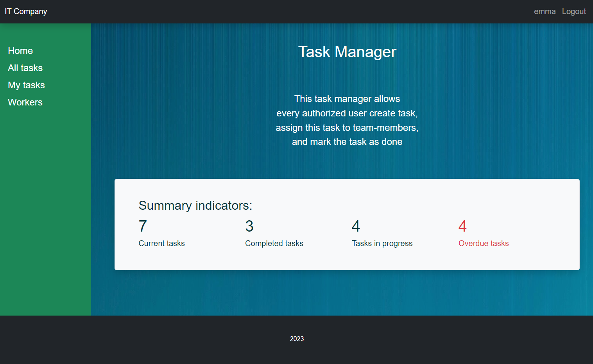
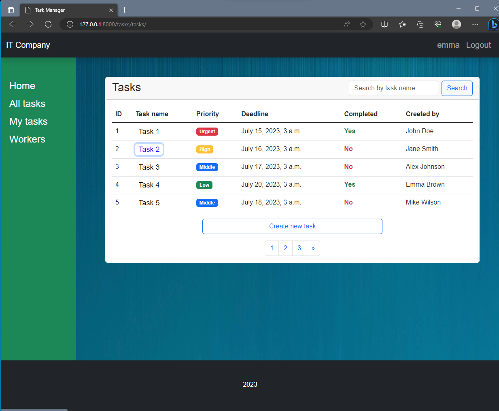
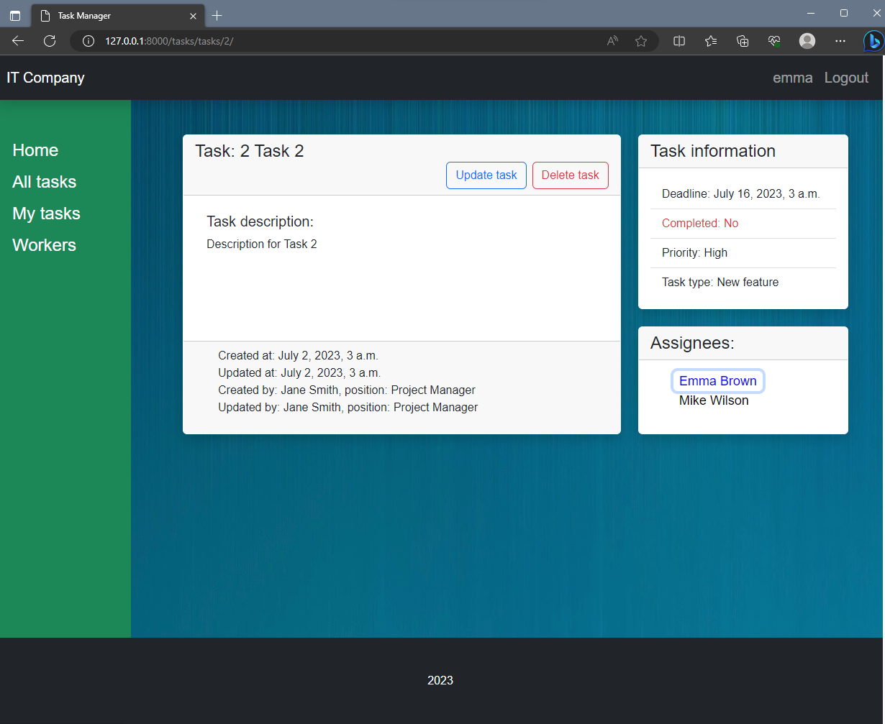
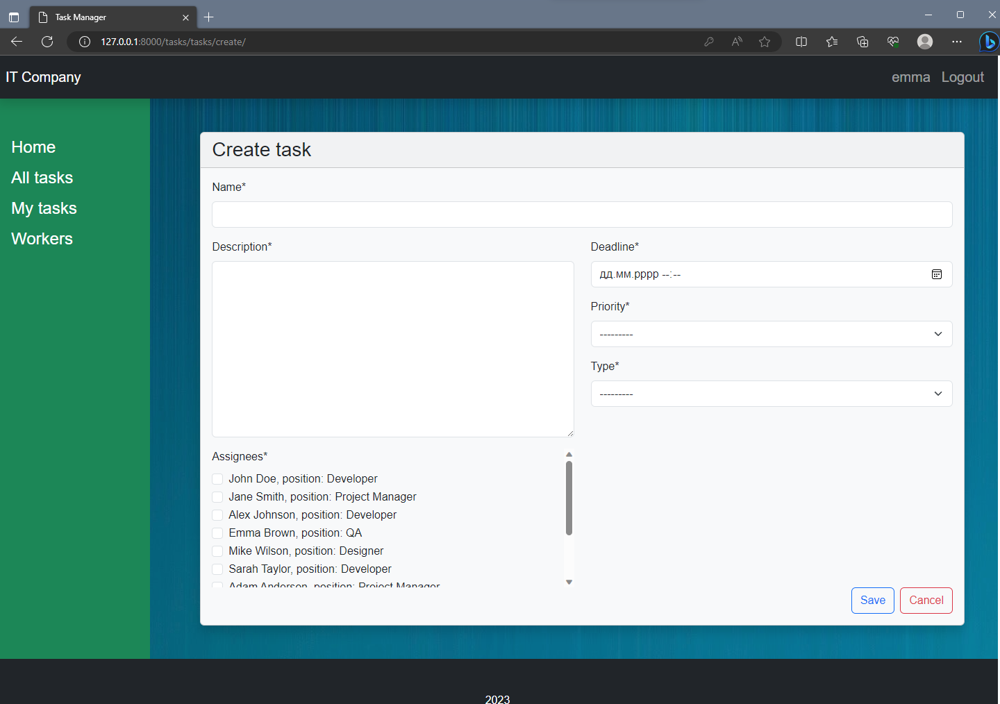
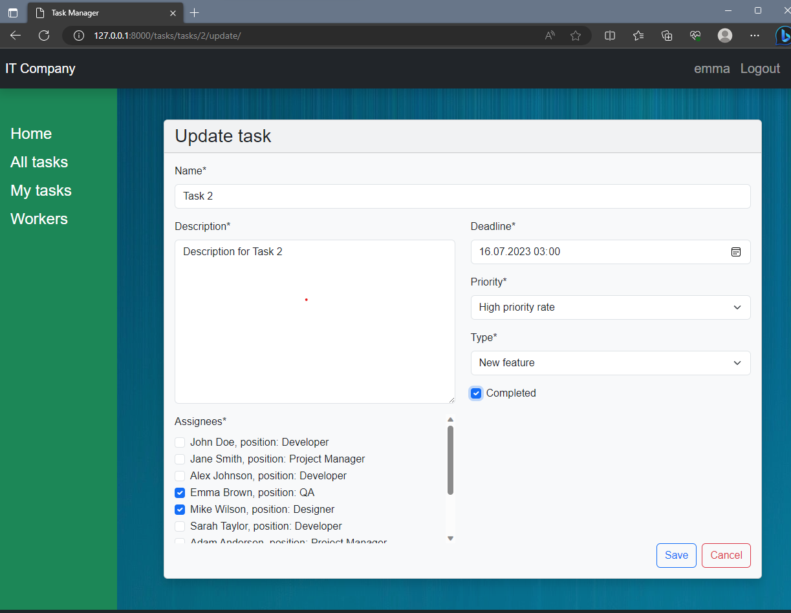
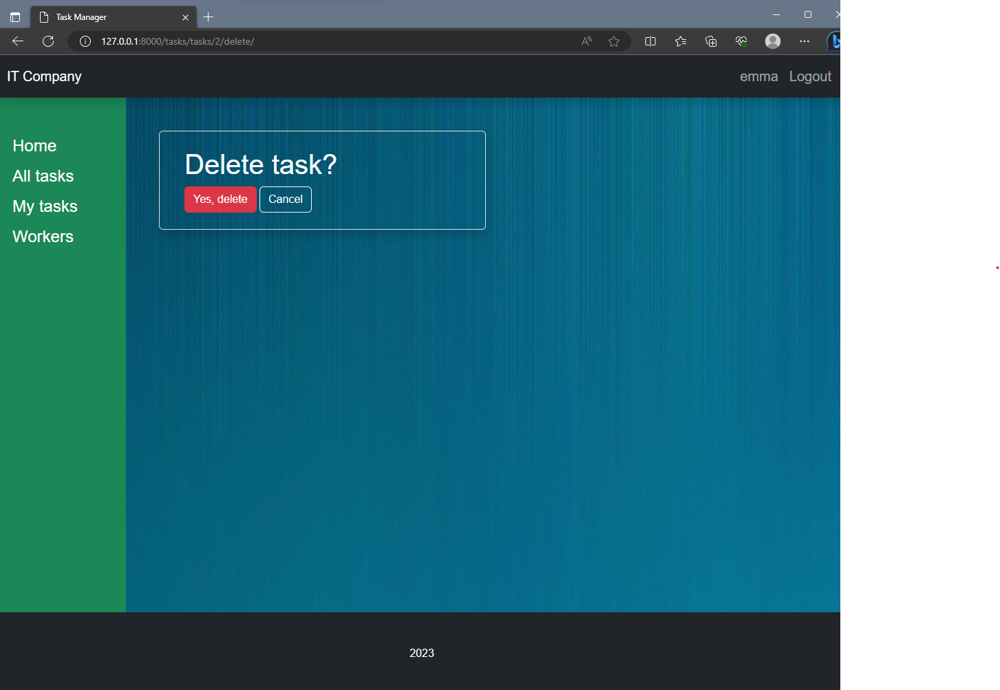
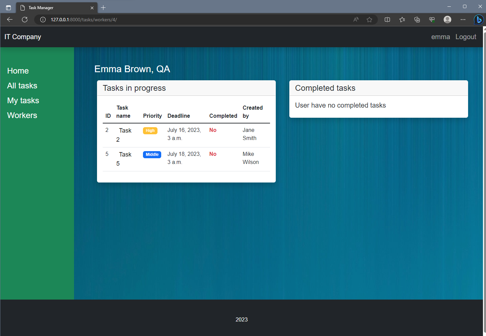
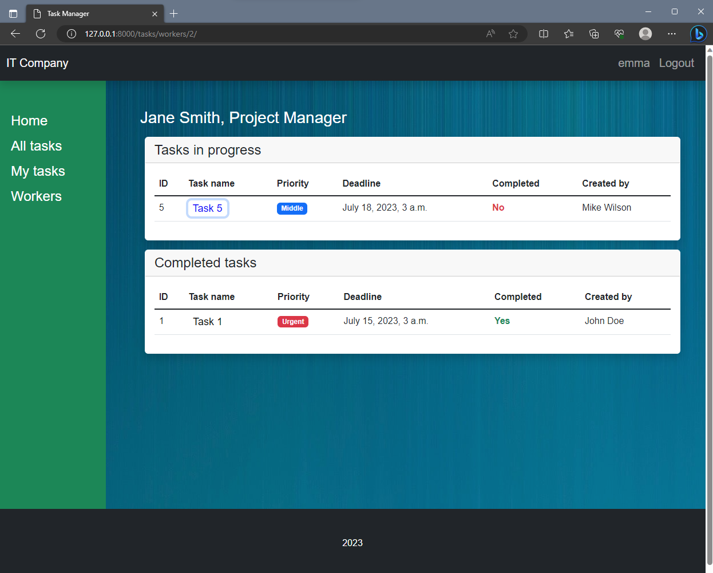
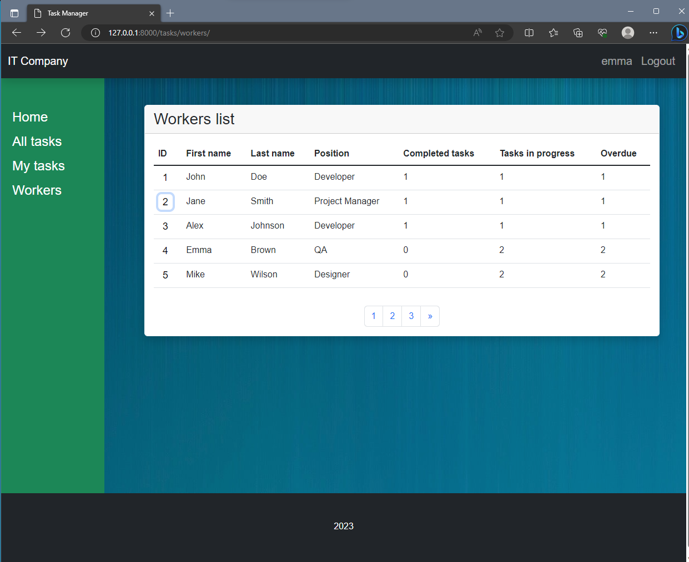
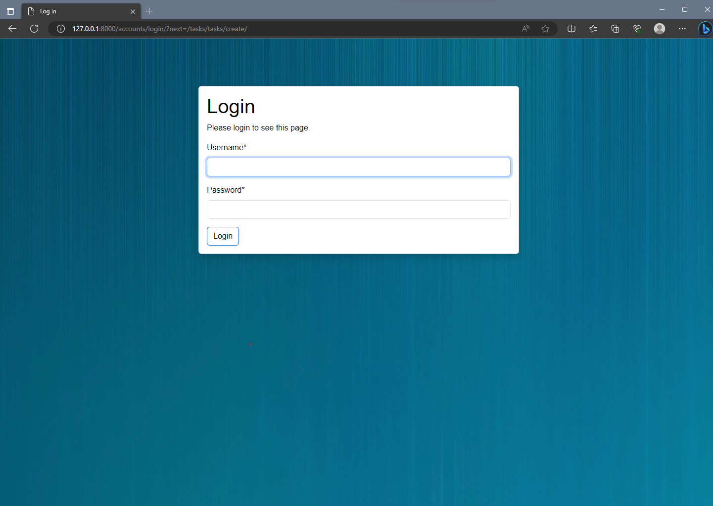

# IT Company task manager

Django project that implement task manager.

## Check it out!

[Task manager project deploy to Render](https://task-manager-hepl.onrender.com/)

To Log in the site, input:

* login: user
* password: user12345

## Quick Start

To get this project up and running locally on your computer:

1. Python3 must be already installed

2. Assuming you have Python setup, run the following commands (if you're on Mac you may use `python3` instead of `py` to
   start Python):
   ```
   git clone https://github.com/Sashkoooo/task-manager
   py -m venv venv
   venv\Scripts\activate (on Windows)
   source venv/bin/activate (on macOS)
   pip install -r requirments
   py manage.py makemigrations
   py manage.py migrate
   py manage.py collectstatic
   py manage.py test # Run the standard tests. These should all pass.
   py manage.py createsuperuser # Create a superuser
   py manage.py runserver
   py manage.py loaddata testdata.json # Install some test data to the database
   ```
3. Open a browser to `http://127.0.0.1:8000/admin/` to open the admin site
4. Create a few test objects of each type.
5. Open tab to `http://127.0.0.1:8000` to see the main site, with your new objects.

## Overview

This web application creates an online task manager for IT company,
where every authorized user create task,
assign this task to team-members,
and mark the task as done.

The main features that have currently been implemented are:

* There are models for task, worker, position and task type.
* Authorized users can:
  * view home (index) page with summary indicators in general
  * view list of all tasks and workers
  * search task by name
  * create new tasks
  * update (mark the task as done) and delete tasks
  * view detail information for tasks and workers.
  * view their own tasks on separate page shown separately: completed & not completed
* Admin users can create new workers, positions and task types.

## Demo












